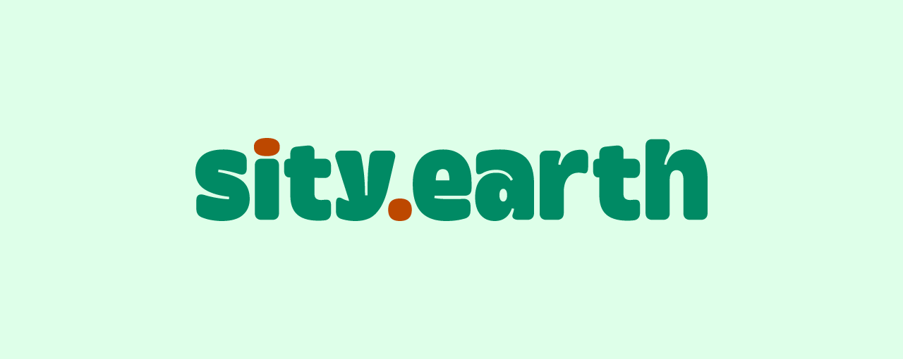

# sity.earth



## About

sity.earth aims to make recycling more accessible and apprehensible through visuals. It serves as an entry point to learn about the impacts of waste. The site helps home sorters properly dispose of waste based on city guidelines and encourages lifestyle changes such as using less, reusing, and keeping waste local.

## Technical Overview

sity.earth is a web app built using [SvelteKit](https://kit.svelte.dev/). Each “page” is a [Svelte](https://svelte.dev/) component consisting of HTML, JavaScript, and [Dart Sass](https://sass-lang.com/dart-sass) (not [node-sass](https://www.npmjs.com/package/node-sass)). The initial request is rendered on the server, but subsequent requests are handled by the client much like a traditional [SPA](https://en.wikipedia.org/wiki/Single-page_application).

User authentication is handled through [Firebase Auth](https://firebase.google.com/docs/auth). The database is [Firestore](https://firebase.google.com/docs/firestore) ([NoSQL](https://en.wikipedia.org/wiki/NoSQL)).


## Getting Started

### Installing Node.js

To check if Node.js is installed on your system, type the following line into a terminal: 

```bash
node -v

# if a version number like this is returned
# it means Node.js is already installed
v16.14.0
```

If Node.js is not installed, head over to [nodejs.org](https://nodejs.org/en/) and download the current LTS version. 

> Note: Node.js should be v16.13.0 or newer to not cause issues with SvelteKit.

### Installing Node Modules

After Node.js is installed, pull all the files from this repo to your computer and install all Node modules:

```bash
npm i
```

You’re all set now! Move on to the next section to see how to start a local development server.

## Developing

Once you start to make edits to the code, start a development server and preview changes in real-time:

```bash
npm run dev

# or start the server and open the app in a new browser tab
npm run dev -- --open

# or start the server and expose it to other devices on the same network
npm run dev -- --host
```

## Building

To create a production version of sity.earth:

```bash
npm run build
```

To preview the production build, type `npm run preview`.

## Commit Messages

[Commit messages](commits/main) usually start with one of the following labels:

- ♿️A11Y: commits related to accessibility.
- 🔧CNFG: commits related to configuration files.
- 💄CSS: commits related to CSS styling in a `.scss` or `.svelte` file.
- 📐DES: commits related to any file in the [designs](designs) directory.
- 📝DOC: commits related to project documentation such as this `README.md` file.
- 🐛FIX: commits that fix a known bug.
- 🏷️HTML: commits related to HTML in a `.svelte` file.
- ✨NEW: initial commits for a new file.
- 🟠SVLT: commits related to Svelte and SvelteKit files, excluding CSS and HTML changes as those have more specific labels.
- 🚧WIP: commits that include partial/broken code.

> Note: earlier commits to this repo include other labels that have now been deprecated or combined.